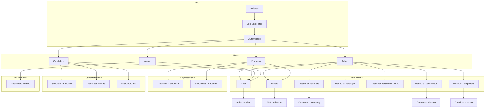

# Diagramas de flujo del sistema

Estos diagramas están escritos en Mermaid y pueden verse con una extensión de VS Code como `vstirbu.vscode-mermaid-preview`.

> Copia el archivo y abre la vista previa de Markdown / Mermaid para visualizar cada diagrama.

---

## 1. Autenticación y acceso

```mermaid
flowchart TD
    A[Visitante] --> B[Login | Register | Forgot password]
    B --> C{¿Guest?}
    C -->|Register candidato| D[GET register/candidato]
    C -->|Register empresa| E[GET register/empresa]
    C -->|Login| F[GET login]
    D --> D2[RegisteredUserController@create]
    E --> E2[RegisterEmpresaController@create]
    F --> F2[AuthenticatedSessionController@create]
    D2 --> D3[POST register/candidato]
    E2 --> E3[POST register/empresa]
    F2 --> F3[POST login]
    D3 --> G[Crear usuario + candidato]
    E3 --> H[Crear usuario + empresa]
    F3 --> I[Autenticación]
    I --> J[Usuario autenticado]
    J --> K{Rol}
    K -->|admin| L[admin.dashboard]
    K -->|empresa| M[empresa.dashboard]
    K -->|candidato| N[candidato.solicitud]
    J --> O[logout]
    O --> A
```

---

## 2. Registro y envío de solicitud de candidato

```mermaid
flowchart TD
    A[Candidato autenticado] --> B[Ir a /candidato/solicitud]
    B --> C[Livewire CandidatoSolicitud mount]
    C --> D{¿Existe Candidato?}
    D -->|Sí| E[Recuperar datos guardados]
    D -->|No| F[Iniciar formulario vacío]
    E --> G[Formulario paso 1..6]
    F --> G
    G --> H[Guardar borrador]
    H --> I[CandidatoService@guardarBorrador]
    I --> J[Candidato creado/actualizado]
    J --> G
    G --> K[Enviar solicitud]
    K --> L[CandidatoService@enviarSolicitud]
    L --> M[Actualizar estado = enviada]
    M --> N[WorkflowService@decideCandidatoRegistration]
    N --> O{Modo workflow}
    O -->|manual| P[estado pendiente]
    O -->|auto| Q[si datos completos -> aprobada]
    N --> R[Crear Postulacion vacante_id=1]
    R --> S[Solicitud enviada]
```

---

## 3. Flujo de candidato para ver vacantes y postularse

```mermaid
flowchart TD
    A[Candidato] --> B[/candidato/vacantes]
    B --> C[Ver vacantes activas]
    A --> D[/candidato/postulaciones]
    D --> E[Ver postulaciones propias]
    C --> F[Selecciona vacante]
    F --> G[POST /candidato/vacantes/{vacante}/postular]
    G --> H{¿solicitud enviada?}
    H -->|No| I[Error: completar solicitud]
    H -->|Sí| J{¿ya postuló?}
    J -->|Sí| K[Error: ya existe]
    J -->|No| L[Crear Postulacion estado postulado]
    L --> M[Redirigir a postulaciones]
```

---

## 4. Flujo de empresa (servicios / solicitudes)

```mermaid
flowchart TD
    A[Empresa] --> B[empresa.dashboard]
    B --> C[Ver solicitudes]
    C --> D[/empresa/solicitudes]
    D --> E[Lista vacantes propias]
    E --> F[Crear solicitud]
    F --> G[GET /empresa/solicitudes/crear]
    G --> H[POST /empresa/solicitudes]
    H --> I[EmpresaController@guardarSolicitud]
    I --> J[Crear Vacante estado pendiente]
    J --> K[WorkflowService@decideVacanteCreation]
    K --> L{Modo workflow}
    L -->|manual| M[permanece pendiente]
    L -->|auto| N[si título+desc ok -> activa]
    E --> O[Ver solicitud / editar solicitud]
    O --> P[PATCH /empresa/postulaciones/{postulacion}/mover]
    P --> Q[Actualizar estado postulacion]
```

---

## 5. Flujo de administrador

```mermaid
flowchart TD
    A[Admin] --> B[admin.dashboard]
    B --> C[Ver empresas]
    B --> D[Ver candidatos]
    B --> E[Ver vacantes]
    C --> F[GET /admin/empresas]
    F --> G[aprobar/rechazar/suspender empresa]
    D --> H[GET /admin/candidatos]
    H --> I[aprobar/rechazar candidato]
    E --> J[GET /admin/vacantes]
    J --> K[Crear vacante]
    K --> L[POST /admin/vacantes]
    J --> M[Activar / Cerrar / Editar / Actualizar]
    J --> N[Matching vacante]
    N --> O[GET /admin/vacantes/{vacante}/matching]
    O --> P[Seleccionar candidato]
    P --> Q[POST /admin/vacantes/{vacante}/asignar]
    Q --> R[Crear Postulacion estado postulado]
    E --> S[PATCH /admin/postulaciones/{postulacion}/estado]
    S --> T[Actualizar estado postulacion: postulado/entrevista/seleccionado/rechazado/retirado]
```

---

## 6. Flujo de tickets y SLA inteligente

```mermaid
flowchart TD
    A[Empresa o Admin] --> B[/tickets]
    B --> C[Lista de tickets]
    A --> D[Crear ticket]
    D --> E[GET /tickets/crear]
    E --> F[POST /tickets]
    F --> G[TicketController@guardar]
    G --> H[SlaInteligenteService@clasificar]
    H --> I[Calcular score por tipo, palabras clave y prioridad]
    I --> J[Determinar prioridad: alta/media/baja]
    J --> K[Calcular sla_due_at]
    G --> L[Crear Ticket estado abierto]
    A --> M[Ver ticket]
    M --> N[GET /tickets/{ticket}]
    N --> O[Responder ticket]
    O --> P[POST /tickets/{ticket}/responder]
    P --> Q[Agregar TicketMessage]
    A --> R[Admin cambia estado]
    R --> S[PATCH /tickets/{ticket}/estado]
    S --> T[Actualizar estado resuelto/en_proceso/abierto/cerrado]
```

---

## 7. Flujo de chat

```mermaid
flowchart TD
    A[Usuario autenticado] --> B[/chat]
    B --> C[Ver lista de salas]
    C --> D[Seleccionar sala]
    D --> E[/chat/{room}]
    E --> F[Ver conversación]
    F --> G[Enviar mensaje]
    G --> H[Crear ChatMessage]
    H --> I[Actualizar vista chat]
```

---

## 8. Flujo de gestión de catálogo y personal externo (admin)

```mermaid
flowchart TD
    A[Admin] --> B[/admin/catalogo]
    B --> C[Lista / Crear / Editar / Eliminar servicio]
    C --> D[GET /admin/catalogo/create]
    C --> E[POST /admin/catalogo]
    C --> F[GET /admin/catalogo/{catalogo}/edit]
    C --> G[PUT /admin/catalogo/{catalogo}]
    C --> H[DELETE /admin/catalogo/{catalogo}]
    C --> I[PATCH /admin/catalogo/{catalogo}/toggle]
    A --> J[/admin/personal-externo]
    J --> K[Lista / Crear / Editar / Eliminar personal]
    K --> L[GET /admin/personal-externo/create]
    K --> M[POST /admin/personal-externo]
    K --> N[GET /admin/personal-externo/{personalExterno}/edit]
    K --> O[PUT /admin/personal-externo/{personalExterno}]
    K --> P[DELETE /admin/personal-externo/{personalExterno}]
    K --> Q[GET /admin/personal-externo/{personalExterno}/modal]
```

---

## 9. Diagrama general consolidado


